<div id="top"></div>

<!-- PROJECT LOGO -->
<br />
<div align="center">
  <a href="https://github.com/hudds-awp2021-cht2520/assignment-01-Wasim27">
    
  </a>

  <h3 align="center">Wasocial</h3>

  <p align="center">
    By Wasim Ramzan (u1970064)
    <br />
    <strong>Advanced Web Programming · Assignment 1</strong>
    <br />
    <strong>University of Huddersfield</strong>
    <br />
    <br />
  </p>
</div>


<!-- TABLE OF CONTENTS -->
<details>
  <summary>Table of Contents</summary>
  <ol>
    <li>
      <a href="#project-description">Project Description</a>
      <ul>
        <li><a href="#technologies-used">Technologies Used</a></li>
      </ul>
    </li>
    <li>
      <a href="#getting-started">Getting Started</a>
      <ul>
        <li><a href="#prerequisites">Prerequisites</a></li>
        <li><a href="#installation">Installation</a></li>
      </ul>
    </li>
    <li><a href="#usage">Usage</a></li>
    <li><a href="#extra-implementations-information">Extra Implementations Information</a></li>
    <li><a href="#testing">Testing</a></li>
    <li><a href="#contact">Contact</a></li>
    <li><a href="#references">References</a></li>
  </ol>
</details>


<!-- PROJECT DESCRIPTION -->
## Project Description


Wasocial is a website that allows users to create and view posts in an efficient manner. Similar to the likes of Facebook, Twitter and other social networks.

Features Implemented:
* Create, read, update and delete posts
* Upload profile picture
* Register and login with authentication
* Like and dislike posts
* View personal and other users posts
* Search for users

The main goal was to keep the website simplistic and not over-complicate any features. There are of course many more features to come, such as comments, following system and more!

<p align="right">(<a href="#top">back to top</a>)</p>


<!-- Technologies Used -->
### Technologies Used

Here are some of the frameworks, libraries and kits used which I made efficient use of whilst creating the website. Using these certain technologies saves time allowing me to focus on the main features of the website.

* [Laravel](https://laravel.com)
* [Laravel Breeze](https://laravel.com/docs/8.x/starter-kits)
* [Laravel Livewire](https://laravel-livewire.com/)
* [HTML]()
* [TailwindCSS](https://tailwindcss.com/)
* [PHP](https://www.php.net/)
* [PHPUnit Test Framework](https://phpunit.de/)

<p align="right">(<a href="#top">back to top</a>)</p>


<!-- GETTING STARTED -->
## Getting Started

Follow these simple steps to set up your project locally.

### Prerequisites

* Composer
  ```
  See official docs https://getcomposer.org/
  ```

* npm
  ```sh
  npm install -g npm
  ```

### Installation

1. Clone the repo
   ```sh
   git clone git@github.com:hudds-awp2021-cht2520/assignment-01-Wasim27.git
   ```
2. Configure the web server to point at the /public directory
   
3. Create a DB in MySQL

4. Install the PHP dependencies
   ```sh
   composer install
   ```
5. Install the node dependencies
   ```sh
   npm install
   ```
6. Build the front end assets
   ```sh
   npm run dev
   ```
7. Make the .env file (copy .env example to .env and fill in the correct DB details)
8. Migrate the database and seed
   ```sh
   php artisan migrate:fresh --seed
   ```
9. Generate application encryption key
   ```sh
   php artisan key:generate
   ```
10. Go to your web server address or run php artisan serve
    ```sh
    php artisan serve
    ```

<br>
<h1></h1>
<br>

<p align="right">(<a href="#top">back to top</a>)</p>


<!-- USAGE EXAMPLES -->
## Usage


### Homepage
<p>Clean homepage with a nice and colourful user interface. Here you have the links to login and register on the top right.

Extra information such as the amount of users signed up and testiomonials from users can be viewed here.

The use of tailwind allowed me to design this UI in a time-saving manner. Hover over the vector image and see what happens!
</p>
<br>

<div align="center">
  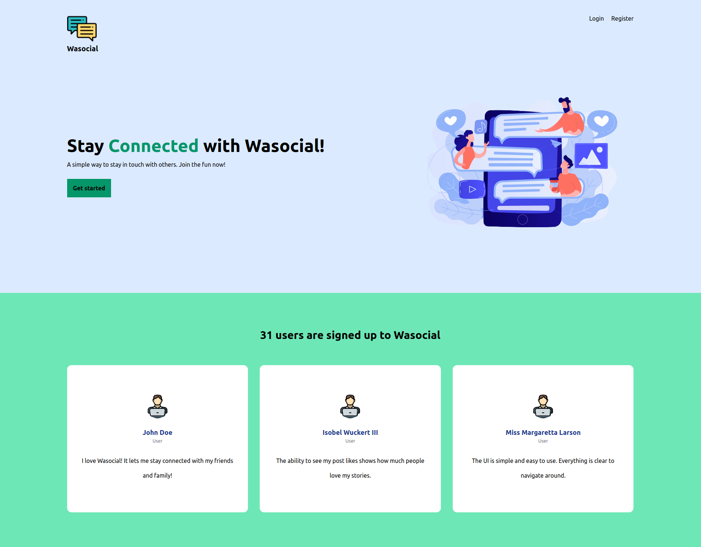
</div>

<br>
<br>
<br>
<br>


<!-- Registration -->
### Registration
Laravel Breeze is a starter kit which creates both the registration and login pages for us. This includes authentication and also uses tailwind as the styling framework.

As you can see, users must enter all the relevant information and follow guidelines in order for their details to be validated. I added a username field as this is important in social network websites to differentiate users - as users may have the same name. In addition, simple regex was used to prevent usernames from having spaces which we tend not to see on similar websites. 
<br>
<br>

<div align="center">
  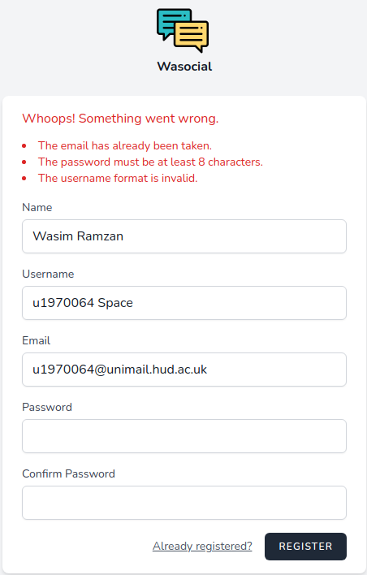
</div>

### Login
Similarly to the registration page, Laravel Breeze handles all this for us. Providing the user gives us the correct details, the website will authenticate them and send them to the feed page. Alternatively, they will have already been sent to the feed page after registration.

Note: Setting up a mail server allows for extra features such as forgot password and email verification.
<br>
<br>
<br>

<div align="center">
  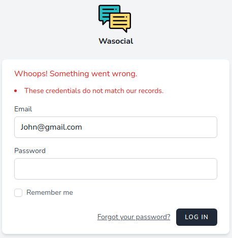
</div>


<!-- Feed -->
### Feed

The feed is where users can do various tasks:
* Create posts: simply write your post in "What's happening?" and click the post button
* Like or dislike a post
* Logout by clicking your name at the top right and logout
* Navigate to a users profile by clicking their name.
* Navigate to the feed, personal profile, and all users table using the buttons on the left sidebar
<br>
<br>

<div align="center">
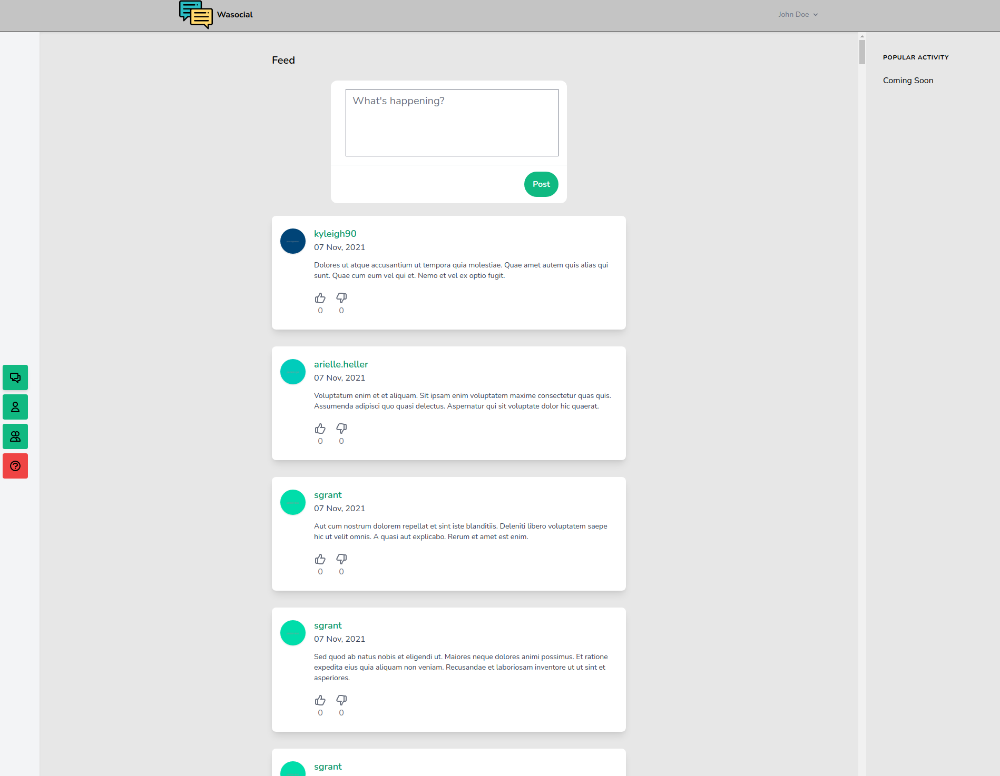
</div>

<br>
<br>
<br>

<p>I am watching the NFL right now so why not make a post about it? Also, likes and dislikes are highlighted for the user to see what their response was and can change between the two if necessary.</p>
<br>

<div align="center">
  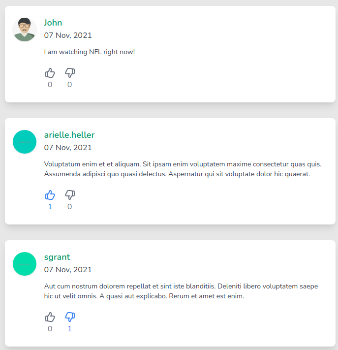
</div>

<br>
<br>

<!-- Users Profile -->
### Users Profile
<p>By clicking a users name you can view all their posts and again like or dislike them.</p>

<br>
<br>

<div align="center">
  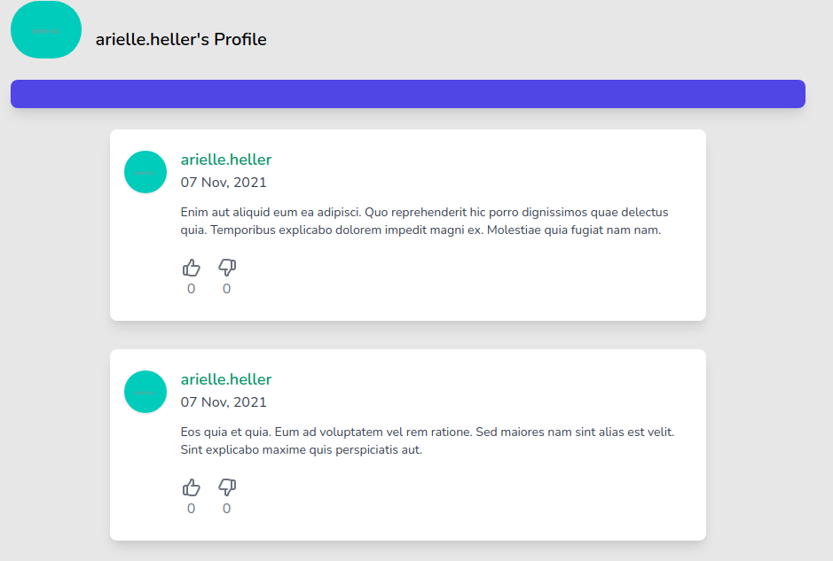
</div>

<br>
<br>

<!-- My Profile -->
### My Profile
By clicking the single user icon on the sidebar, this takes you to the logged in users profile page.

Further tasks can be done here:
* Create posts (again)
* View likes and dislikes (again)
* Change profile image
* Edit posts: click the edit button next to the post
* Delete posts: click the trash button next to the post

Upload a profile photo heres one I am using https://www.vhv.rs/dpng/d/491-4918790_lion-logo-royalty-free-copyright-free-lion-logo.png and the changes will be made.
<br>
<br>


<div align="center">
  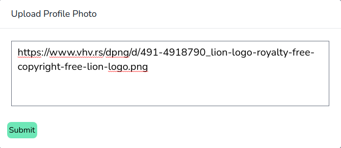
</div>

<br>
<br>

<div align="center">
  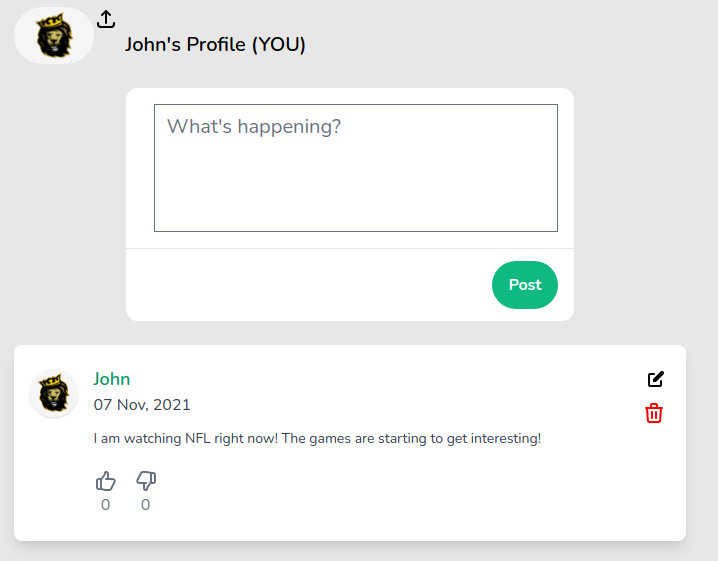
</div>

<br>
<br>

Clicking the edit button will show a modal which has the body of the post to edit in the text area. This allows users to make edits and then click submit.

<br>

<div align="center">
  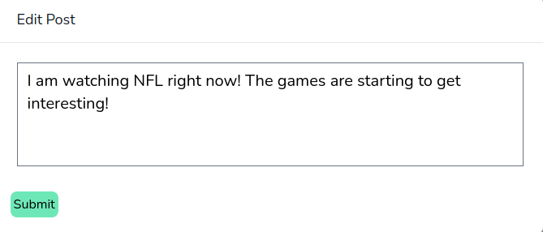
</div>
<br>

Clicking the trash bin will ask for confirmation that you really want to delete it. No one wants to accidentally click that amazing post they created!

<br>

<div align="center">
  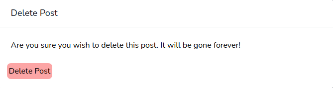
</div>

<p align="right">(<a href="#top">back to top</a>)</p>


<!-- Users Table -->
### Users Table
Clicking the sidebar button which has two users as the icons takes you to the user list section. Here you can view all the users along with some details. Also, you can search for users here and go to their profile. This makes it easier to look for users.

<br>

<div align="center">
  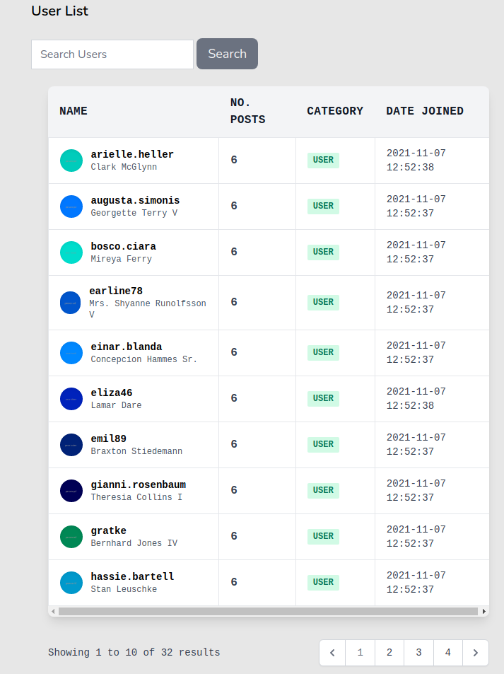
</div>

Search results for "John"

<br>
<br>

<div align="center">
  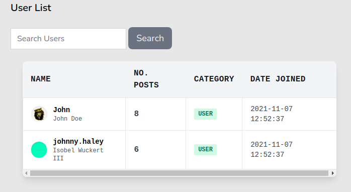
</div>

<br>
<h1>
<br>


<!-- Extra Implementations Information -->
## Extra Implementations Information
Implementation information not mentioned previously:
* Laravel livewire was used to create the modals for uploading a profile photo, as well as editing and deleting posts. Functions include rendering the modal, tracking the post and making the relevant changes/updates. For editing the target post, a function was created to mount the posts body to the modal. <strong>See App\Http\Livewire</strong>

* Factories and seeders were used to create fake users, posts and likes. Fake likes can be viewed on the profile page of the default user.

Default user details:

Email: John@gmail.com

Password: testacc123

<br>
<h1>
<br>


<!-- TESTING -->
## Testing
Testing is done using PHPUnit as this is what Laravel provides us by default.
Again, Laravel Breeze automatically created the authentication tests. I have created my own tests which can be viewed within <strong> LivewireModalTest.php </strong> and <strong>UserExperienceTest.php</strong> files within the tests directory.

My tests: 
* Livewire offers its own tools for testing my components. Hence, I have created tests for: whether the profile photo can be updated and if posts can be deleted

* UserExperienceTest includes:
  * All views can be rendered
  * Posts can be created
  * Posts can be liked/disliked

I have done this through assertions and checking if values exist or do not exist within the database.

To run tests simply run:

    php artisan test    

... and all tests should pass!

<br>
<br>

<div align="center">
  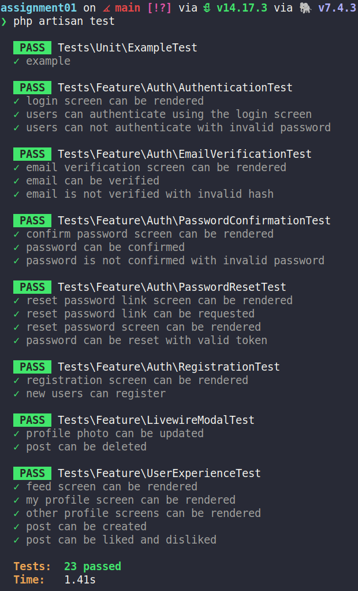
</div>

<br>
<br>
<strong>IMPORTANT: MUST REFRESH AND RESEED THE DATABASE FOR THE WEBSITE WORK AFTER RUNNING TESTS</strong>

<br>

  ```
  php artisan migrate:fresh --seed
  ```

<p align="right">(<a href="#top">back to top</a>)</p>

<br>
<h1>
<br>


<!-- CONTACT -->
## Contact

Wasim Ramzan

University Email: u1970064@unimail.hud.ac.uk

Project Link: [https://github.com/hudds-awp2021-cht2520/assignment-01-Wasim27](https://github.com/hudds-awp2021-cht2520/assignment-01-Wasim27)

<p align="right">(<a href="#top">back to top</a>)</p>

<br>
<h1>
<br>


<!-- REFERENCES -->
## References

Most references are inlined within the code however here are some that assisted in creating certain features.

* Vhvrs. Lion Logo Royalty-free. https://www.vhv.rs/viewpic/hJJomiJ_lion-logo-royalty-free-copyright-free-lion-logo/
* Jeffrey Way (2020). Build a Like/Dislike System. Laracasts. https://laracasts.com/series/laravel-6-from-scratch/episodes/67?page=1
* Akhtar Munir (2020). search with pagination is not working in laravel. [Answer]. Stackoverflow. https://stackoverflow.com/questions/61771858/search-with-pagination-is-not-working-in-laravel

<p align="right">(<a href="#top">back to top</a>)</p>
