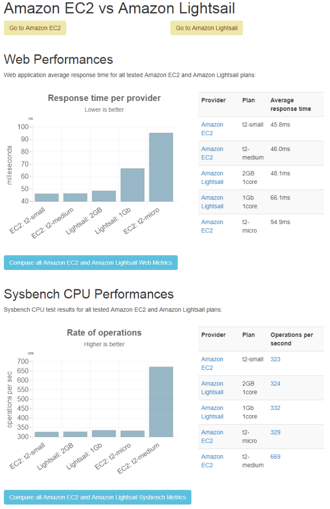

<div id="top"></div>

<!-- PROJECT LOGO -->
<br />
<div align="center">
  <a href="https://github.com/hudds-awp2021-cht2520/assignment-01-Wasim27">
    
  </a>

  <h3 align="center">Wasocial</h3>

  <p align="center">
    By Wasim Ramzan (u1970064)
    <br />
    <strong>Advanced Web Programming · Assignment 2</strong>
    <br />
    <strong>University of Huddersfield</strong>
    <br />
    <br />
  </p>
</div>


<!-- TABLE OF CONTENTS -->
<details>
  <summary>Table of Contents</summary>
  <ol>
    <li>
      <a href="#project-description">Project Description</a>
      <ul>
        <li><a href="#advanced-features-implemented">Advanced Features Implemented</a></li>
        <li><a href="#technologies-used">Technologies Used</a></li>
      </ul>
    </li>
    <li>
      <a href="#getting-started">Getting Started</a>
      <ul>
        <li><a href="#prerequisites">Prerequisites</a></li>
        <li><a href="#installation">Installation</a></li>
      </ul>
    </li>
    <li><a href="#usage">Usage</a></li>
    <li><a href="#extra-implementations-information">Extra Implementations Information</a></li>
    <li><a href="#testing">Testing</a></li>
    <li><a href="#reflective-analysis">Reflective Analysis</a></li>
    <li><a href="#contact">Contact</a></li>
    <li><a href="#references">References</a></li>
  </ol>
</details>


<!-- PROJECT DESCRIPTION -->
## Project Description

<div align="center">
  
</div>

Wasocial is a website that allows users to create and view posts in an efficient manner. Similar to the likes of Facebook, Twitter and other social networks. \
\
During the second assignment my main focus was on implementing advanced features.

<br>

<!-- Advanced Features Implemented -->
### Advanced Features Implemented

* Following and unfollowing feature
* Google Two Factor Authentication
* Docker
* Build & Deploy to AWS Lightsail (Nginx) \
... and other changes to some features

<p align="right">(<a href="#top">back to top</a>)</p>


<!-- Technologies Used -->
### Technologies Used

Here are some of the frameworks, libraries and kits used which I made efficient use of whilst creating the website. Using these certain technologies saves time, allowing me to focus on the main features of the website.

* [Laravel](https://laravel.com)
* [Laravel Breeze](https://laravel.com/docs/8.x/starter-kits)
* [Laravel Livewire](https://laravel-livewire.com/)
* [HTML]()
* [TailwindCSS](https://tailwindcss.com/)
* [PHP](https://www.php.net/)
* [PHPUnit Test Framework](https://phpunit.de/)

<p align="right">(<a href="#top">back to top</a>)</p>


<!-- GETTING STARTED -->
## Getting Started

Docker is now the best way to get the project setup allowing for efficient management of the dependencies.

### Prerequisites

* Docker & Docker-compose

### Installation

1. Clone the repo
   ```sh
   git clone git@github.com:hudds-awp2021-cht2520/assignment-02-Wasim27.git
   ```

2. Build Dockerfile and start containers
   ```
   docker-compose build && docker-compose up -d
   ```
   
3. Install the PHP dependencies
   ```sh
   docker-compose exec app composer install
   ```

4. Make the .env file (copy .env.example to .env no changes are required)

5. Provide permissions to the following folders
    ```
    sudo chmod -R 777 storage/
    sudo chmod -R 777 bootstrap/cache/
    ```

5. Migrate the database and seed
   ```sh
   docker-compose exec app php artisan migrate:fresh --seed
   ```
6. Generate application encryption key
   ```sh
   docker-compose exec app php artisan key:generate
   ```
7. Go to the web server hosted by nginx \
http://localhost:8088/

<p align="right">(<a href="#top">back to top</a>)</p>


<!-- USAGE EXAMPLES -->
## Usage
<br>

### Following and unfollowing feature
<p>Users can now follow and unfollow eachother. This is a feature we see popular on social media where you can follow profiles of others. There is a lot of scalabiltiy with this feature. For example, I could further implement features such as messaging your followers, viewing only posts of those you follow and privacy options.

This was out of scope of my advanced features task as my interest was mainly on features that I aren't already similar to the ones I have done already.

You can view your followers on the right sidebar and click on them to go to their profile. This helps keep track on their lifestyle. Also, on the feed page the top 10 most followed users will be displayed.

Simply visit any users profile and follow them (or unfollow if you have already followed them)!
</p>
<br>

<div align="center">
  
</div>

<br>
<br>
<br>


<!-- Google Two Factor Authentication -->
### Google Two Factor Authentication
Two factor authentication is essential for most websites as it enhances your security. Users are now able to use the Google Authenticator app as a secondary login security feature. Simply click on the security badge on the sidebar click generate secret key and follow the instructions to get setup!

Once setup users must verify their code to access the website. If the code expires on the app you may have to refresh the page and try again.

Pragmarx Google2fa a password authentication package provides me with the ability to generate OTP and verify these are correct.
<br>
<br>

<div align="center">
  
</div>

<div align="center">
  
</div>

<br>
<br>
<br>

<!-- Docker -->
### Docker
Docker allows me to create containers which contain my dependencies. It also provides the ability to run code in any environment. Docker has made it easier for me to build, deploy and manage containers.

On the other hand, docker compose enables me to configure server and storage dependencies. \
Here are the containers that I have running:

* MySQL; database creation and management
* Nginx; webserver to host my site
* Mailhog; fake SMTP server for email testing
* PHP; run PHP commands in the container
<br>
<br>

Apart from Mailhog the others should be self explanatory. We can use mailhog to test emails such as the forgotten password feature. If we were to send an email password reset link then it can be viewed on mailhog.

To view them after resetting a registered users password visit http://localhost:8025/

<div align="center">
  
</div>

<br>
<br>
<br>

<!-- AWS Lightsail -->
### AWS Lightsail

IMPORTANT: Docker will have the fully functioning website. AWS Lightsail will work for most features but does not have an email server. Also, it has not been fully tested so use Docker for most tasks.

AWS Lightsail similarly allows me to build and deploy my application but this time on the cloud. AWS Lightsail is a virtual private server provider. They provide many services such as database storage and hosting my application on the cloud. This is better for scalability as it does not require me to purchase a physical server myself.

This would particularly work well if my website was to go live. For example, I could manage domain names, backup my website and conduct many other management functions. To summarise, it would allow me to manage my app efficiently.

Currently, using the free tier as it is suitable for my needs. Again, I chose Nginx to host my webserver as seen below.

<br>

<div align="center">

</div>

<div align="center">

</div>

<br>

NOTE: NO LONGER DEPLOYED ON AWS!

<br>
<br>

<!-- Extra Implementations Information -->
## Extra Implementations Information
* Factories and seeders were used to create fake users, posts and likes. Fake likes can be viewed on the profile page of the default user

  Default user details:
  ```
  Email: John@gmail.com

  Password: testacc123
  ```
<br>

<!-- TESTING -->
## Testing
Testing is done using PHPUnit as this is what Laravel provides us by default.

Test updates:
* Changed test files to contain their respective models/controller methods rather than mixing them
* Further tests for views (2fa and other pages)
* Tests for the following/unfollowing feature
* Tests must be run in the docker container
* The 2fa middleware can be tested in the routes by visiting /test_middleware

I have done this through assertions and checking if values exist or do not exist within the database.

To run tests simply run in the docker container:

    docker-compose exec app php artisan test   

... and all tests should pass!

<br>
<br>

<div align="center">
  
</div>

<br>
<br>
<strong>IMPORTANT: MUST MIGRATE AND RESEED THE DATABASE FOR THE WEBSITE TO WORK AFTER RUNNING TESTS</strong>
<br>

  ```
  docker-compose exec app php artisan test
  ```

<p align="right">(<a href="#top">back to top</a>)</p>

<!-- Reflective Analysis-->
## Reflective Analysis

I chose AWS Lightsail as the cloud platform of my choice as it is what I found simplest to use. To get setup I only had to do small amounts of configuration and it was rather quick. The part which took most time was waiting for the instances/databases to create which is not a huge issue! 

To create my instances I had to simply select my platform (Linux) and host (Nginx). Next steps were simple such as generating an ssh key, region and plan etc. After this I was able to ssh to the server and clone my application. After creating the database and setting it up on my .env file then configuring HTTP/HTTPS I was pretty much complete. Furthermore, the process was really simple and did not have any issues which I have not encountered previously.

Despite this, there were many alternatives such as Heroku which is supposedly more catered towards startups. Social media websites are resource intesive therefore AWS is the platform that can meet those high computational demands. Although mine wont go live, it would be very easy to scale and meet demands if for example my website were to receive more traction.

I am of course in charge of security issues of my server such as not leaking the key etc. For the cloud itself I can be safe with AWS security and rely on them to manage the cloud infrastructure. Alternatively, if I had a physical server I would be responsible for its security which could be daunting. Another essential feature is snapshots to backup my server. This would be important for any issues that occur on the server and always having a backup to rely on. 

As mentioned previously, one of the main reasons I picked Lightsail was due to its simplicity. However, there is another AWS service called EC2. EC2 overall is much more powerful than Lightsail and provides greater server and database performance. With EC2 I would have to manually do alot of the things that were simpler on Lightsail such as configuring settings and generating the ssh key. The added complexity of EC2 was not worth it for my goals, although if I required increase in performance, it would be the viable option.

An improvement I could have done with Lightsail was to deploy my docker containers - as it would let me work with Mailhog and other dependencies which I have.

<br>

<div align="center">
  
</div>

<br>
<br>

<p align="right">(<a href="#top">back to top</a>)</p>
<br>

<!-- CONTACT -->
## Contact

Name: Wasim Ramzan

University Email: u1970064@unimail.hud.ac.uk

Project Link: [https://github.com/hudds-awp2021-cht2520/assignment-01-Wasim27](https://github.com/hudds-awp2021-cht2520/assignment-01-Wasim27)

<p align="right">(<a href="#top">back to top</a>)</p>


<!-- REFERENCES -->
## References

Most references are inlined within the code however here are some that assisted in creating certain features.

* Vhvrs. Lion Logo Royalty-free. https://www.vhv.rs/viewpic/hJJomiJ_lion-logo-royalty-free-copyright-free-lion-logo/
* Jeffrey Way (2020). Build a Like/Dislike System. Laracasts. https://laracasts.com/series/laravel-6-from-scratch/episodes/67?page=1
* Akhtar Munir (2020). search with pagination is not working in laravel. [Answer]. Stackoverflow. https://stackoverflow.com/questions/61771858/search-with-pagination-is-not-working-in-laravel
* Stephen Afam-Osemene (2020). How to Add Google's Two Factor Authentication to Laravel. https://www.digitalocean.com/community/tutorials/how-to-add-googles-two-factor-authentication-to-laravel
* Akshay Krison (2021). How to Deploy Laravel APP on AWS LightSail. https://aws.plainenglish.io/deploy-laravel-app-on-aws-lightsail-with-nginx-instance-and-managed-mysql-db-643670e2e24d
* Rakesh Soni (2017). What is difference between Lightsail and EC2?. [Answer]. Stackoverflow. https://stackoverflow.com/questions/40927189/what-is-difference-between-lightsail-and-ec2

<p align="right">(<a href="#top">back to top</a>)</p>
